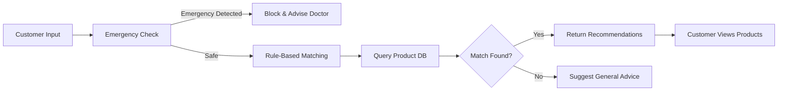

# 🏥 AB Medical Assistance

<div align="center">


**A full-stack medical assistance and pharmacy workflow prototype — featuring product catalog management, order tracking, customer feedback, owner analytics, and a rule-based AI medicine recommendation assistant.**

[Features](#-features) • [Tech Stack](#-tech-stack) • [Installation](#-installation) • [Usage](#-usage) • [API Reference](#-main-api-groups) • [Deployment](#-deployment-notes)

> ⚠️ **Disclaimer:** This project is intended for portfolio demonstration and local development only. It is not a medical device and must not be used as a substitute for professional medical advice.

</div>

---

## 🌟 Features

### For Customers
- 🔐 **Secure Authentication** - Registration, login, JWT-based auth, and logout
- 🛍️ **Product Catalog** - Browse products with categories, stock status, and images
- 🛒 **Cart & Checkout** - Stock-validated cart with seamless checkout experience
- 📦 **Order Tracking** - Full order history with detailed order views
- 🤖 **AI Recommendation Assistant** - Rule-based medicine suggestions from the live product database
- ⭐ **Product Feedback** - Leave reviews after confirmed purchases

### For Owners & Admins
- 🏪 **Product Management** - Create, edit, soft delete, and manage inventory with image uploads
- 📋 **Order Management** - View all orders and update statuses in real time
- 📊 **Analytics Dashboard** - Business insights and performance tracking
- 🧠 **AI Analytics** - Monitor recommendation patterns and usage

### Platform Features
- 🔑 **Role-Based Access** - Distinct roles for customers, owners, and admins
- 🚨 **Emergency Detection** - AI blocks product recommendations on emergency symptoms
- 🐘 **PostgreSQL-Ready** - SQLite for development, PostgreSQL for production via environment variables

---

## 🛠️ Tech Stack

### Backend
- **Django** - High-level Python web framework
- **Django REST Framework** - RESTful API layer
- **SimpleJWT** - JSON Web Token authentication
- **SQLite** - Default development database
- **PostgreSQL** - Production-ready via environment configuration

### Frontend
- **React + Vite** - Fast, modern frontend build tooling
- **React Router** - Client-side routing
- **Tailwind CSS** - Utility-first styling
- **Framer Motion** - Smooth UI animations
- **Lucide React** - Clean icon system

---

## 🚀 Installation

### Prerequisites

- Python 3.8 or higher
- Node.js 18 or higher
- pip and npm

### Backend Setup

1. **Clone the repository**
   ```bash
   git clone https://github.com/salamlakhan7/ab-medical-assistance.git
   cd ab-medical-assistance
   ```

2. **Create and activate a virtual environment**
   ```powershell
   cd backend
   python -m venv .venv
   .\.venv\Scripts\Activate.ps1
   ```

3. **Install dependencies**
   ```bash
   pip install -r requirements.txt
   ```

4. **Configure environment variables**
   ```powershell
   Copy-Item backend\.env.example backend\.env
   ```

   Then set the following in your `.env`:
   ```env
   DJANGO_SECRET_KEY=replace-with-a-long-local-secret
   DJANGO_DEBUG=True
   DJANGO_ALLOWED_HOSTS=127.0.0.1,localhost,testserver
   DB_ENGINE=sqlite
   CORS_ALLOWED_ORIGINS=http://localhost:5173
   CSRF_TRUSTED_ORIGINS=http://localhost:5173
   ```

5. **Run migrations and create a superuser**
   ```bash
   python manage.py migrate
   python manage.py createsuperuser
   ```

6. **Start the backend server**
   ```bash
   python manage.py runserver
   ```

   - API: `http://127.0.0.1:8000/`
   - Admin Panel: `http://127.0.0.1:8000/admin/`

### Frontend Setup

Open a second terminal from the project root:

```bash
cd frontend
npm install
npm run dev
```

Frontend dev server: `http://127.0.0.1:5173/`

> The Vite dev server proxies all `/api` requests to the Django backend automatically.

---

## 📖 Usage Guide

### For Customers

1. **Register** - Create an account at `/register`
2. **Browse** - Explore the public product catalog at `/products`
3. **Add to Cart** - Add items and proceed to checkout at `/cart`
4. **Track Orders** - View order history and statuses at `/orders`
5. **Get Recommendations** - Use the AI assistant at `/ai-assistant`

### For Owners / Admins

1. **Dashboard** - Access analytics and management at `/owner-dashboard`
2. **Manage Products** - Create, update, or soft-delete listings with images
3. **Process Orders** - View incoming orders and update their statuses
4. **Monitor AI Usage** - Review recommendation analytics

---

## 🗺️ Main Routes

```
/                  Public landing page
/products          Public product catalog
/login             Login
/register          Registration
/logout            Logout
/cart              Customer cart and checkout
/orders            Customer order history
/ai-assistant      AI recommendation assistant
/owner-dashboard   Owner and admin dashboard
```

---

## 📡 Main API Groups

```
/api/auth/
/api/categories/
/api/products/
/api/cart/
/api/orders/
/api/recommendations/
/api/dashboard/
/api/feedback/
```

---

## 🔧 Environment Variables

| Variable | Description |
|---|---|
| `DJANGO_SECRET_KEY` | Django secret key (required) |
| `DJANGO_DEBUG` | `True` for development, `False` for production |
| `DJANGO_ALLOWED_HOSTS` | Comma-separated list of allowed hosts |
| `DB_ENGINE` | `sqlite` for dev, `postgresql` for production |
| `POSTGRES_DB` | PostgreSQL database name |
| `POSTGRES_USER` | PostgreSQL username |
| `POSTGRES_PASSWORD` | PostgreSQL password |
| `POSTGRES_HOST` | PostgreSQL host |
| `POSTGRES_PORT` | PostgreSQL port |
| `CORS_ALLOWED_ORIGINS` | Allowed CORS origins |
| `CSRF_TRUSTED_ORIGINS` | Trusted CSRF origins |

---

## 📁 Project Structure

```
AB-Medical-Assistance/
├── backend/
│   ├── apps/
│   │   ├── accounts/
│   │   ├── ai_assistant/
│   │   ├── carts/
│   │   ├── dashboard/
│   │   ├── feedback/
│   │   ├── orders/
│   │   └── products/
│   ├── config/
│   ├── manage.py
│   ├── requirements.txt
│   └── .env.example
├── frontend/
│   ├── src/
│   ├── package.json
│   └── vite.config.js
├── docs/
│   └── project_state.md
├── .gitignore
└── README.md
```

---

## 🔄 Recommendation Workflow



If the diagram does not render, view this file on GitHub or a Markdown viewer.

---

## 🖼️ Media Handling

Product images are uploaded through the product API and stored under:

```
backend/media/
```

The local media directory is excluded from Git. For production, use persistent media storage such as a cloud object store, platform volume, or dedicated media service.

---

## 🚢 Deployment Notes

Before deploying to production:

- Set `DJANGO_SECRET_KEY` to a strong, unique secret value
- Set `DJANGO_DEBUG=False`
- Configure `DJANGO_ALLOWED_HOSTS`, `CORS_ALLOWED_ORIGINS`, and `CSRF_TRUSTED_ORIGINS`
- Switch `DB_ENGINE=postgresql` and provide all PostgreSQL credentials
- Configure persistent media storage (S3, Cloudinary, or similar)
- Serve the React build through a static host or reverse proxy
- Run `python manage.py migrate` on the production database
- Review HTTPS, HSTS, and cookie security settings

> Docker and deployment automation are not included yet. Contributions welcome.

---

## ✅ Verification

**Backend:**
```powershell
cd backend
$env:DJANGO_SECRET_KEY="replace-with-a-long-local-secret"
$env:DJANGO_ALLOWED_HOSTS="127.0.0.1,localhost,testserver"
python manage.py check
python manage.py migrate --check
python manage.py test
```

**Frontend:**
```bash
cd frontend
npm run build
```

---

## 🤝 Contributing

Contributions are welcome! Please follow these steps:

1. Fork the repository
2. Create a feature branch (`git checkout -b feature/YourFeature`)
3. Commit your changes (`git commit -m 'Add YourFeature'`)
4. Push to the branch (`git push origin feature/YourFeature`)
5. Open a Pull Request

---

## 👤 Author

**Abdul Salam** — [GitHub](https://github.com/salamlakhan7) • [LinkedIn](https://linkedin.com/in/abdul-salam-501b2025b)

---

## 📝 License

No license file has been added yet. Add a license before public release if reuse permissions should be explicit.

---

## 🗺️ Roadmap

- [ ] Email notifications for order updates
- [ ] PDF prescription upload and parsing
- [ ] AI assistant upgrade to LLM-backed recommendations
- [ ] Redis-based caching for product queries
- [ ] Mobile-responsive UI improvements
- [ ] Docker + deployment automation
- [ ] Admin audit logging

---

<div align="center">

**Built with Django + React**

⭐ Star this repo if you find it useful!

</div>
